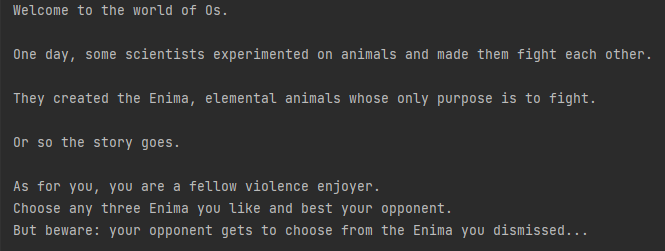
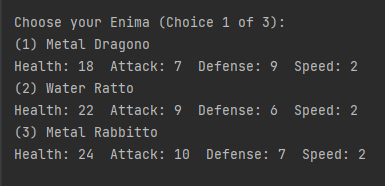
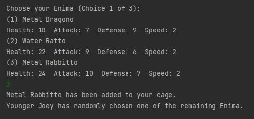
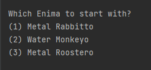
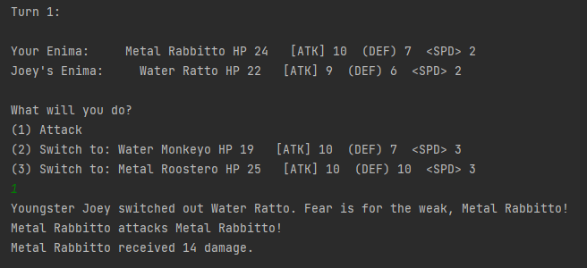
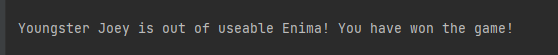

# World Of Os
World of Os is a text-based game where you engage your opponent in 3v3 turn-based combat 
using creatures made from lab experiments. 

These creatures are called Enima, short for elemental animals.

# Main Features
- Enima stats and elements are randomly generated.
- Each Enima has an elemental attack.
- Every element is strong against one element, weak against one element, and resisted by one element exactly.

#  How to Play
1. Choose from a pool of three Enima to join your team, using the num keys 1, 2 or 3.
2. Your computer opponent will then choose from the remaining two Enima.
3. Do this three times and you will have a team of 3 Enima.
4. Defeat your opponent's team of three and win!

# Example Screenshots
At the start of the game, you are greeted with this message:

Then, the draft will start and you will be allowed to select your Enima:

After selecting your Enima, your opponent will choose his:

At the beginning of combat, you are prompted to choose your starting Enima:

During combat, you can choose to attack or switch to a different Enima:

Once all three Enima on the opposing side has been defeated, you win!

# How to Run the Game
On Windows platforms (Python installation not required):
1. Run the 'World of Os 1.1.exe' file in the output folder.

On other platforms or if the exe file failed to work (Python installation required):
1. Run 'main.py' on your preferred Python IDE, or in the command line.

# Sofware Information
- Written in Python 3.9.
- 'World of Os 1.0.exe' was made using auto-py-to-exe in Windows 8.1.
- 'World of Os 1.1.exe' was made using auto-py-to-exe in Windows 10.

# Version History
1. Version 1.0: 1 December 2022
2. Version 1.1: 19 November 2023